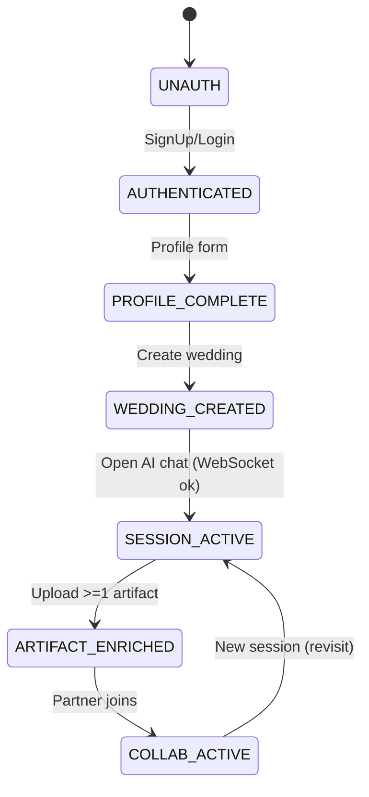

# Sanskara AI Design Document

---

## Table of Contents
1. [Project Overview](#project-overview)
2. [Goals & Intended Audience](#goals--intended-audience)
3. [System Architecture](#system-architecture)
4. [Installation & Setup](#installation--setup)
5. [Onboarding & User Flow](#onboarding--user-flow)
6. [Usage Guide](#usage-guide)
7. [Best Practices](#best-practices)
8. [AI-Centric Features](#ai-centric-features)
9. [Security & Privacy](#security--privacy)
10. [Future Implementations](#future-implementations)
11. [FAQ](#faq)
12. [Contributing](#contributing)
13. [License](#license)

---

## Project Overview

**Sanskara AI** is a next-generation, AI-powered wedding planning platform. It integrates with Supabase for real-time data, provides a user-friendly dashboard, and leverages AI to optimize tasks, vendor management, and personalized suggestions.

---

## Goals & Intended Audience

| Goal                                  | Description                                                                 |
|---------------------------------------|-----------------------------------------------------------------------------|
| Seamless Wedding Planning             | Centralize all planning aspects in one dashboard.                           |
| Personalization via AI                | Use AI to suggest rituals, tasks, and vendors tailored to user preferences. |
| Real-Time Collaboration               | Enable couples, families, and planners to collaborate live.                 |
| Data Security                         | Ensure user data is private and secure.                                     |

**Intended Audience:**
- Couples planning weddings
- Professional wedding planners
- Vendors
- Developers interested in AI-driven event management

---

## System Architecture

```mermaid
graph TD;
  A[User Interface (React)] --> B[API Layer]
  B --> C[Supabase Backend]
  B --> D[AI Services]
  D --> E[Recommendation Engine]
  D --> F[Analytics & Insights]
  C --> G[Database]
```

- **Frontend:** React + TypeScript, Framer Motion, React Router
- **Backend:** Supabase (Postgres, Auth, Storage)
- **AI Layer:** Custom APIs for recommendations, NLP, and automation

---

## Installation & Setup

1. **Clone the repository:**
   ```sh
   git clone https://github.com/your-org/Sanskara_AI.git
   ```
2. **Install dependencies:**
   ```sh
   cd sanskara-ai-weddings-planner
   npm install
   ```
3. **Configure environment variables:**
   - Copy `.env.example` to `.env` and fill in:
     - `VITE_SUPABASE_URL`
     - `VITE_SUPABASE_ANON_KEY`
     - `VITE_API_BASE_URL` (REST + WS base)
     - `VITE_ENABLE_ARTIFACTS=true`
     - `VITE_APP_NAME=sanskara` (mandatory `app_name` tag for artifact/session APIs)
4. **Run the app:**
   ```sh
   npm run dev
   ```

---

## Onboarding & User Flow

### Overview
The onboarding sequence captures user identity, wedding context, partner collaboration, and prepares an AI session with optional artifact (file) enrichment.

### High-Level Steps
| Step | Name | Trigger | Output / Persisted Data | Next |
|------|------|--------|--------------------------|------|
| 1 | Account Creation | Email / OAuth | `users` row | 2 |
| 2 | Primary Profile | Form (names, locale, date prefs) | `profiles` row | 3 |
| 3 | Wedding Context | Select traditions, tentative date(s), location | `weddings` row | 4 |
| 4 | Partner Invite (optional) | Email invite | `invites` row, pending collaborator | 5 |
| 5 | AI Session Bootstrap | Open General Assistant chat | WebSocket `session_id` | 6 |
| 6 | Artifact Introduction | User sees empty session artifacts panel | (optional uploads) | 7 |
| 7 | First AI Interaction | User sends greeting / question | Transcript start | Loop |
| 8 | Deep Personalization | AI suggests tasks/rituals (writes to DB) | `tasks`, `ritual_recs` | Continuous |

### Detailed Flow Description
1. **Account Creation:** Standard Supabase auth collects email + password (or OAuth provider). Minimal friction, defers exhaustive wedding details.
2. **Profile Enrichment:** Collect user + partner names, time zone, cultural/linguistic preferences. Used to seed AI prompt context (e.g., language tone, regional rituals).
3. **Wedding Context Initialization:** Store high-level style (traditional / modern / fusion), approximate date window, city/region. This powers scheduling heuristics (seasonality, vendor lead times).
4. **Partner Collaboration:** An invite token enables multi-user editing; once accepted, both users share wedding context, tasks, artifacts, and AI chat continuity.
5. **AI Session Bootstrap:** Opening the chat initializes a WebSocket. Server responds with a `session` message containing `session_id`. This `session_id` scopes artifact uploads and analysis for that live conversation.
6. **Artifacts (Optional Early Stage):** User can upload documents (PDF schedules, guest list CSV exported as text, images of inspiration). Each upload is versioned and bound to session + `app_name` (always `sanskara`).
7. **First Interaction:** User greets the assistant. Assistant returns personalized onboarding suggestions (critical tasks based on date delta, missing vendor categories, cultural ritual checklist).
8. **Adaptive Loop:** As user uploads artifacts or asks clarifying questions, AI enriches knowledge base and suggests refinements (e.g., “Your venue capacity vs guest estimate mismatch”).

### State Machine (Simplified)


### WebSocket & Artifacts Interaction
| Event | Source | Effect |
|-------|--------|--------|
| `session` | Server | Store `session_id`, reset artifact store |
| User file drop/upload | Client | `POST /artifacts/upload` with `user_id`, `session_id`, `app_name` |
| `listArtifacts` refresh | Client (manual / future polling) | Merge artifact metadata into Zustand store |
| Send chat message with selected files | Client | Appends `[FILES: name1, name2]` marker (temporary convention) |
| AI references version | Assistant prompt parsing | User can click to insert "Analyze artifact version vXYZ" |

### Validation & Constraints
- Max file size: 10MB (configurable). Larger uploads rejected client-side.
- Allowed MIME families (current): `image/`, `text/`, `application/pdf` (enforced in future enhancement layer).
- `app_name` mandatory to partition product surfaces (default: `sanskara`).
- Session artifacts are ephemeral per session; persistence strategy can optionally promote selected artifacts to long-term user workspace.

### UX Principles
| Principle | Implementation |
|-----------|---------------|
| Fast First Value | Defer artifact uploads; user can chat immediately once session established. |
| Progressive Disclosure | Advanced features (bulk analyze, version history) gated behind panel. |
| Transparency | Display connection state (connecting / reconnecting / failed). |
| Recoverability | Reconnect logic attempts exponential backoff; selection preserved if keep-selection is enabled. |

### Future Onboarding Enhancements
- Guided “First 5 Tasks” auto-inserted after initial greeting.
- Ritual preference quiz (short multi-step) auto-informing timeline generation.
- Smart artifact type detection (guest list vs budget) with tailored follow-up prompts.
- Polling + diff banner: “New artifact versions detected – refresh view”.

### Metrics (Suggested)
| Metric | Purpose |
|--------|---------|
| Time to First Message | Measure initial friction. |
| Profile Completion Rate | Detect drop before personalization. |
| Artifact Adoption % | Track enrichment usage. |
| Partner Invite Acceptance Rate | Collaboration health. |
| Tasks Auto-Accepted vs Suggested | AI recommendation relevance. |

---

## Usage Guide

- **Dashboard:** View wedding stats, confirmed guests, budget, tasks, and timeline.
- **Tasks:** Add, edit, and track tasks. Statuses: To Do, Doing, Done.
- **Vendors:** Manage and remove vendors. Real-time updates after actions.
- **AI Suggestions:** Get ritual and vendor recommendations based on preferences.
- **Error Handling:** UI remains responsive even if a data fetch fails.

---

## Best Practices

- Use unique keys for list rendering to avoid UI bugs.
- Always handle API errors gracefully and log them for debugging.
- Use environment variables for sensitive data.
- Keep UI components modular and reusable.
- Validate user input on both frontend and backend.

---

## AI-Centric Features

| Feature                  | Description                                                     |
|-------------------------|-----------------------------------------------------------------|
| Ritual Suggestions      | AI recommends rituals based on tradition and preferences.         |
| Vendor Matching         | Smart matching of vendors to user needs.                         |
| Task Prioritization     | AI suggests which tasks to focus on next.                        |
| Timeline Optimization   | Automated scheduling based on dependencies and deadlines.         |
| Budget Insights         | AI highlights overspending and suggests optimizations.            |

---

## Security & Privacy

- User authentication via Supabase Auth.
- Data access is scoped to authenticated users.
- No sensitive information is exposed in logs or UI.
- Follow best practices for environment variable management.

---

## Future Implementations

| Feature                    | Description                                 |
|---------------------------|---------------------------------------------|
| Mobile App                | Native iOS/Android app for planning on-the-go|
| Advanced Analytics        | Deeper insights into budget, guests, and tasks|
| Multi-language Support    | UI and AI suggestions in multiple languages  |
| AI Chatbot                | 24/7 planning assistant                     |
| Third-Party Integrations  | Payments, calendars, and more               |
| Offline Mode              | Plan without internet, sync when online      |

---

## FAQ

**Q:** Is my data secure?
**A:** Yes, all data is managed by Supabase with strict access controls.

**Q:** Can I invite others to collaborate?
**A:** Yes, real-time collaboration is supported.

**Q:** What if an API fails?
**A:** The dashboard is resilient—other data will still load, and errors are logged.

---

## Contributing

1. Fork the repo and create a new branch.
2. Follow code style guidelines and write clear commit messages.
3. Open a pull request with a detailed description.

---

## License

MIT License. See [LICENSE](../LICENSE) for details.

---

> **Designed with ❤️ by the Sanskara AI Team**
